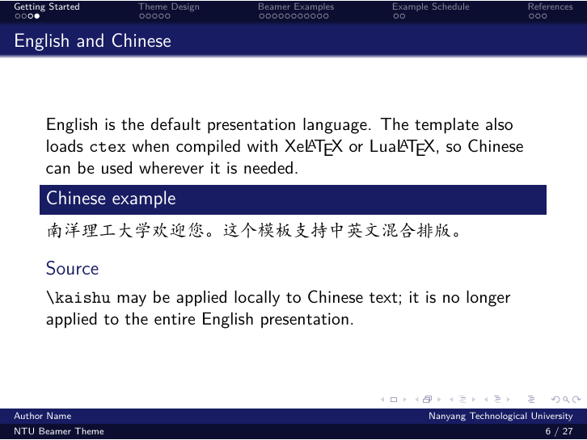
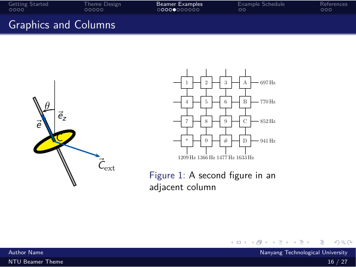

# NTU Classic Beamer Theme

> **Unofficial:** This community template is not affiliated with, maintained
> by, or endorsed by Nanyang Technological University.

An NTU-branded Beamer theme using the official NTU Blue from
`../NTUBrandingGuide.md`.

## Usage

The sample presentation and documentation are written in English. Chinese text
remains supported through `ctex`.

Compile with XeLaTeX:

```sh
xelatex slide.tex
```

LuaLaTeX can also be used. pdfLaTeX remains available for English-only decks,
but it does not provide the template's Chinese text support.

The theme entry point is:

```tex
\usepackage{NTU}
```

Chinese can be mixed directly into an English slide:

```tex
\begin{frame}{English and Chinese}
  English text

  {\kaishu 南洋理工大学欢迎您。}
\end{frame}
```

## Demo Images

These previews are rendered directly from `slide.pdf`.




