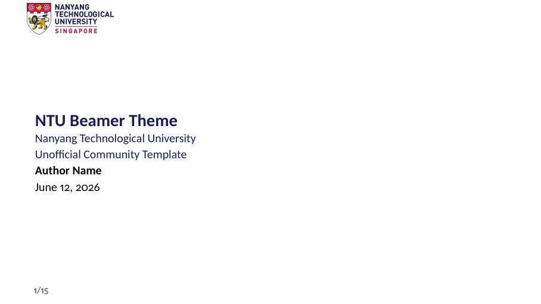
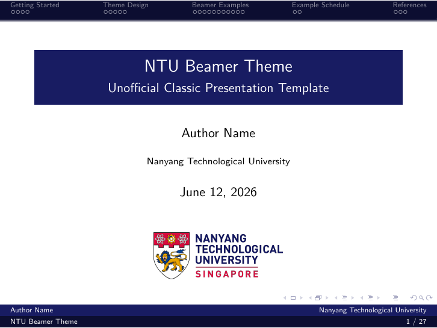

# NTU Beamer Templates

> [!IMPORTANT]
> This is an unofficial community project. It is not affiliated with,
> maintained by, or endorsed by Nanyang Technological University.

Two Beamer presentation templates adapted for Nanyang Technological University
(NTU), using a navy-forward palette based on the included
[NTU branding guide](NTUBrandingGuide.md).

## Templates

### Modern Template

The modern template provides a clean 16:9 layout, reversed NTU branding for
dark backgrounds, section slides, color blocks, and side-picture layouts.



Source and rendered example:

- [`ModernTemplete/beamerntu.tex`](ModernTemplete/beamerntu.tex)
- [`ModernTemplete/beamerntu.pdf`](ModernTemplete/beamerntu.pdf)

Compile it with XeLaTeX or pdfLaTeX:

```sh
cd ModernTemplete
xelatex beamerntu.tex
```

Use the theme in a presentation with:

```tex
\documentclass{beamer}
\usetheme{ntu}
```

### Classic Template

The classic template uses Beamer's smooth navigation bar and a denser academic
layout. Its sample content is written in English, while Chinese typesetting
remains supported through `ctex`.



Source and rendered example:

- [`OlderTemplete/slide.tex`](OlderTemplete/slide.tex)
- [`OlderTemplete/slide.pdf`](OlderTemplete/slide.pdf)

Compile it with XeLaTeX:

```sh
cd OlderTemplete
xelatex slide.tex
bibtex slide
xelatex slide.tex
xelatex slide.tex
```

Use the theme package with:

```tex
\documentclass{beamer}
\usepackage[UTF8,scheme=plain]{ctex}
\usepackage{NTU}
```

XeLaTeX or LuaLaTeX is required when using Chinese text. English-only
presentations may also be compiled with pdfLaTeX after omitting `ctex`.

## Branding

The templates use NTU Blue (`#181C62`) as their primary color and include
standard and reversed NTU logo assets. See
[`NTUBrandingGuide.md`](NTUBrandingGuide.md) for the palette and usage notes.

The repository-level logo sources are available as
[`NTU_Logo.svg`](NTU_Logo.svg), [`NTU_Logo.webp`](NTU_Logo.webp), and
[`NTU_Logo.png`](NTU_Logo.png). The SVG is retained as the editable vector
source for future template and asset updates.

NTU names, logos, and marks belong to Nanyang Technological University. Their
inclusion in this repository does not imply official endorsement.

## Credits

These templates are NTU adaptations of the following open-source Tsinghua
University Beamer projects:

- **Modern template:** [FangWHao/THU-beamer-template](https://github.com/FangWHao/THU-beamer-template)
- **Classic template:** [tuna/THU-Beamer-Theme](https://github.com/tuna/THU-Beamer-Theme)

Thanks to the original authors and contributors for creating and sharing the
themes on which this repository is based.

## License

The two upstream templates retain their respective license files:

- [`ModernTemplete/LICENSE`](ModernTemplete/LICENSE) - GNU General Public License v3
- [`OlderTemplete/LICENSE`](OlderTemplete/LICENSE) - LaTeX Project Public License 1.3c

Logo and brand assets may be subject to separate NTU trademark and brand-usage
requirements.
